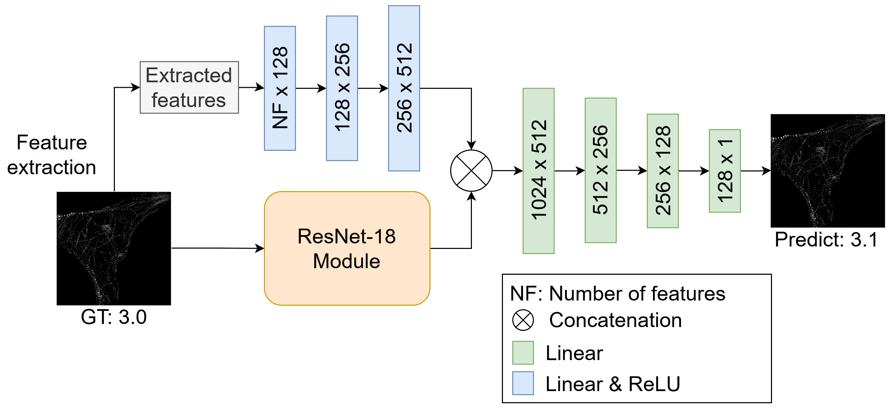

# SarcNet: A novel AI-based framework to automatically analyze and score sarcomere organizations in fluorescently tagged hiPSC-CMs
We propose SarcNet, a cell-features concatenated and linear layers-added ResNet-18 convolutional neural network (CNN) for automatically quantifying sarcomere structure organizations on single-cell images of hiPSC-CMs. In particular, this model leverages predictions by concatenating the output from the ResNet-18 module and a representation vector of quantitative single-cell measurements of subcellular organization, followed by the addition of four linear layers to gain deeper linear representations.

# Preparations
## Dataset
The data is available at https://open.quiltdata.com/b/allencell/packages/aics/integrated_transcriptomics_structural_organization_hipsc_cm. Please download:
- Data 1: 2d_autocontrasted_fields_and_single_cells_fish_1/rescale_2D_single_cell_tiff_path
- Data 2: 2d_autocontrasted_fields_and_single_cells_fish_2/rescale_2D_single_cell_tiff_path
- CSV 1: 2d_autocontrasted_single_cell_features_fish_1/features/a749d0e2_cp_features.csv
- CSV 2: 2d_autocontrasted_single_cell_features_fish_2/features/1493afe2_cp_features.csv
- File meta 1: 2d_autocontrasted_fields_and_single_cells_fish_1/metadata.csv
- File meta 2: 2d_autocontrasted_fields_and_single_cells_fish_2/metadata.csv
## Downloading dependencies
Run the command `pip install -r requirements.txt` to install the necessary libraries.
# Training
Please run the file `train.py` using the following command:

`python train.py --csvpath1 YOUR_PATH_OF_CSV1 --csvpath2 YOUR_PATH_OF_CSV2 --metapath1 YOUR_PATH_OF_META1 --metapath2 YOUR_PATH_OF_META2 --datapath1 YOUR_PATH_OF_DATA1 --datapath2 YOUR_PATH_OF_DATA2`

The outputs would include:
- best_model_corr.pt: model with the highest Spearman Correlation on the validation dataset
- best_model_loss.pt: model with the lowest validation loss
- training.log: file log of the training and validation processes. In the end, the two best models (best_model_corr.pt and best_model_loss.pt) would be evaluated on the testing dataset on the four evaluation metrics of Spearman Correlation, MAE, MSE, and R2 score.
- loss.png: an image drawing training and validation loss through epochs
# Testing
Please run the file `test.py` using the following command:

`python test.py --csvpath1 YOUR_PATH_OF_CSV1 --csvpath2 YOUR_PATH_OF_CSV2 --metapath1 YOUR_PATH_OF_META1 --metapath2 YOUR_PATH_OF_META2 --datapath1 YOUR_PATH_OF_DATA1 --datapath2 YOUR_PATH_OF_DATA2 --checkpoint 'best_model_corr.pt'`

The output would include the results of the four evaluation metrics (Spearman Correlation, MAE, MSE, and R2 score) on the testing dataset.
# Reference
Gerbin, K.A., Grancharova, T., Donovan-Maiye, R.M., Hendershott, M.C., Anderson, H.G., Brown, J.M., Chen, J., Dinh, S.Q., Gehring, J.L., Johnson, G.R., Lee, H., Nath, A., Nelson, A.M., Sluzewski, M.F., Viana, M.P., Yan, C., Zaunbrecher, R.J., Cordes Metzler, K.R., Gaudreault, N., Knijnenburg, T.A., Rafelski, S.M., Theriot, J.A., Gunawardane, R.N.: Cell states beyond transcriptomics: Integrating structural organization and gene expression in hipsc-derived cardiomyocytes. Cell Syst 12(6), 670–687 e10 (2021). DOI 10.1016/j.cels.2021.05.001. URL https://doi.org/10.1016/j.cels.2021.05.001

# Contact
If you have any concerns or support on running this repository, please drop an email at ```hieu.ph@vinuni.edu.vn```
